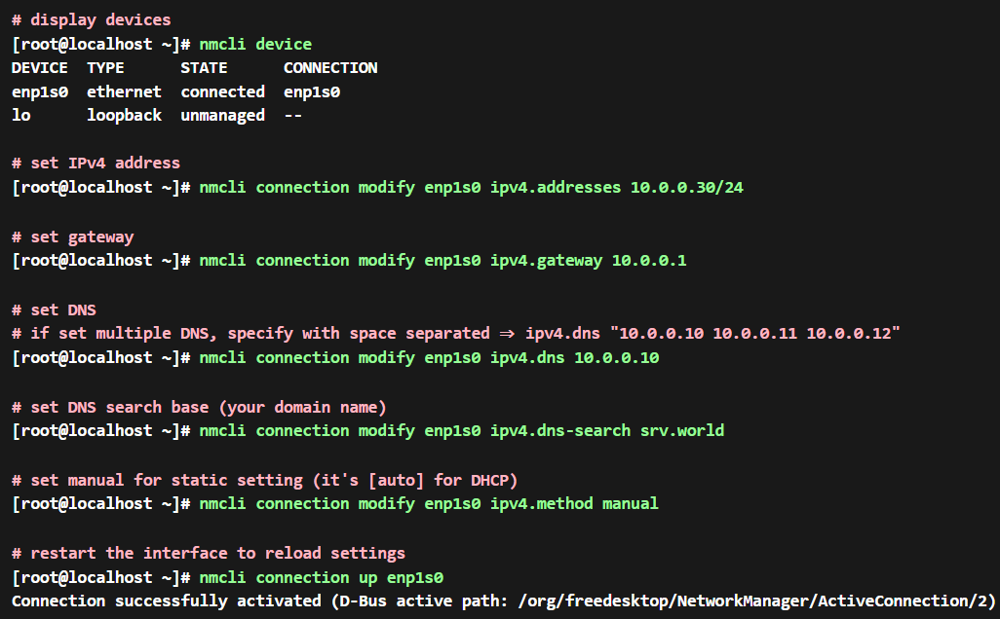

= Fedora / Opensuse Tumbleweed network configuration

== Static ip configuration

sudo nmcli connection modify enp0s3 ipv4.addresses 192.168.1.30/24 +
sudo nmcli connection modify enp0s3 ipv4.gateway 192.168.1.1 +
sudo nmcli connection modify enp0s3 ipv4.dns 8.8.8.8 +
sudo nmcli connection modify enp1s0 ipv4.dns-search srv.world +
sudo nmcli connection modify enp0s3 ipv4.method manual +

sudo systemctl restart NetworkManager

