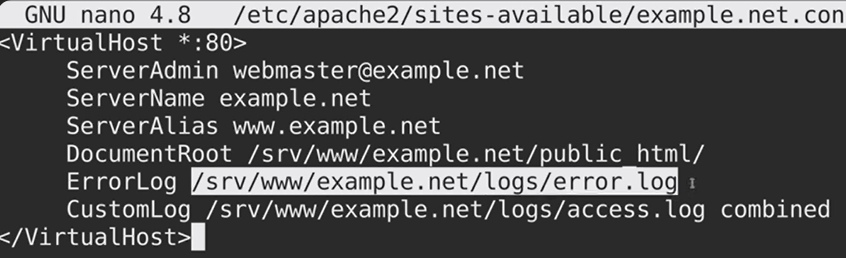

= Ubuntu - Apache configuration

== Installation

sudo apt install apache2 +
sudo apache2ctl -k start +
sudo systemctl enable apache2 +

Sites file config : */etc/apache2/sites-available*

== Create site

sudo nano /etc/apache2/sites-available/site_name.com/net.conf

*DON'T FORGET* to create folders specified in the site configuration file : +
Mkdir -p /srv/www/[…]

== Commands
[cols=2, options="header"]
|===
|Command
|Description

|*sudo a2enmod*
|Activate / see what module is currently active

|*sudo a2dismod*
|Desactivate / see what module is currently inactive

|*sudo a2ensite [site_name]*
|Execute the command at : */etc/apache2/site-enabled* to Activate the specified site

|*sudo a2dissite [site_name]*
|Execute the command at : */etc/apache2/site-enabled* to Desactivate the specified site
|===

== Logs
/var/log/apache2/error.log +
/var/log/apache2/access.log +
*sudo journalctl apache2*
