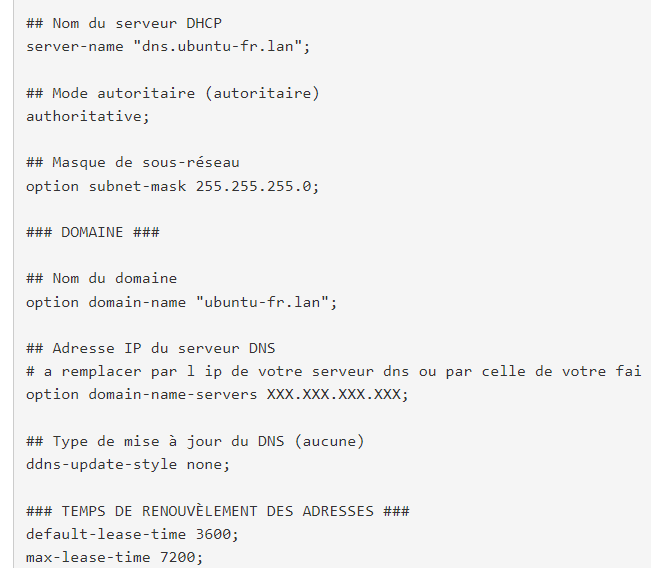
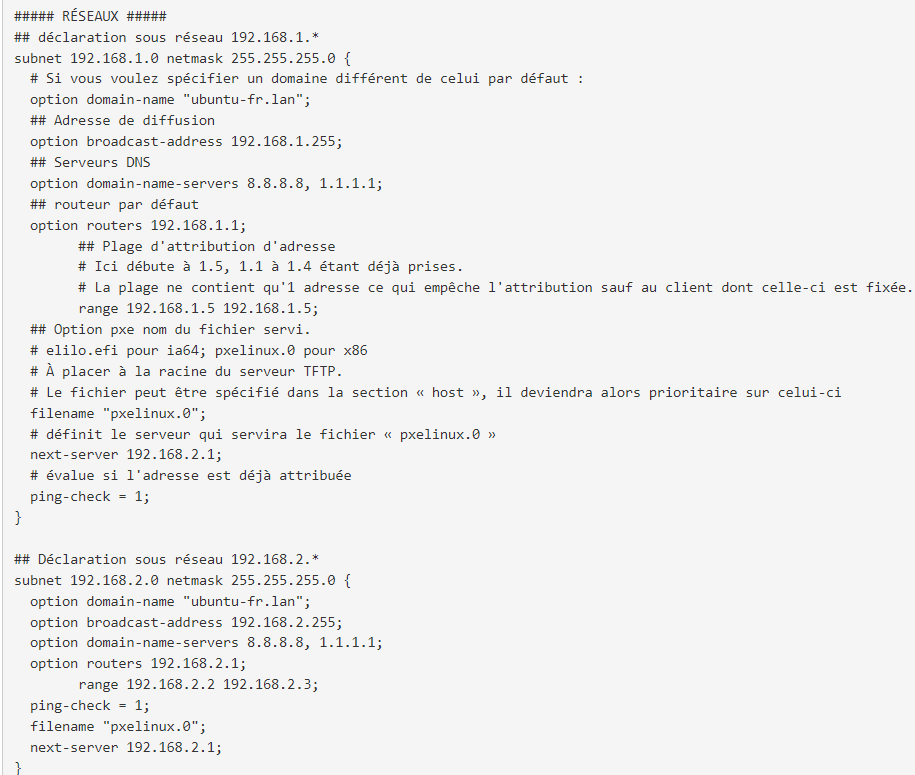

= Ubuntu - DHCP configuration

== Installation
sudo apt install isc-dhcp-server +
config file : */etc/dhcp/dhcp.conf*, /etc/default/isc-dhcp-server(declare interface, dns, enable authoritative and subnet range?) +
*lease file : /var/lib/dhcp/dhcpd.leases*

== Configuration
* IT IS REALLY IMPORTANT TO NEVER FORGET TO ADD THE DHCP SERVER SUBNET EVEN IF THIS SUBNET DON'T NEED DHCP
** Without it, service would not be able to start and the error information are not very specific about that error

== Configuration Backup / Failover
----
/etc/dhcp/dhcpd.conf
	failover peer "dhcp-failover" {
	  primary 192.168.1.10;       # IP of the primary server
	  secondary 192.168.1.20;     # IP of the secondary server
	  port 647;                   # Default failover port
	  max-response-delay 60;
	  max-unacked-updates 10;
	  mclt 1800;                  # Minimum Client Lease Time (in seconds)
	  split 50;                   # Split of lease time between servers
	
	  # Shared Secret - Make sure this matches the key from primary server
	  secret "mysecretkey123";    # Use the same secret you set in the authoritative DHCP server
	}

----

== Validation
*Configuration file validation :* sudo dhcpd -t -cf /etc/dhcp/dhcp.conf +
tail -f /var/log/syslog | grep dhcpd
