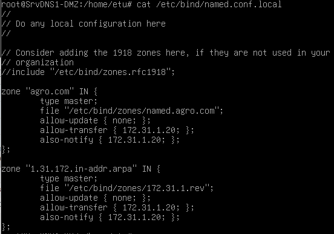
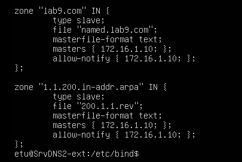
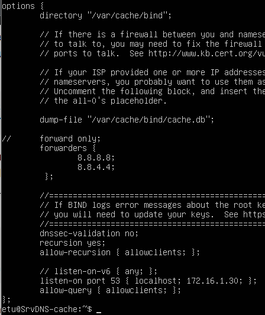
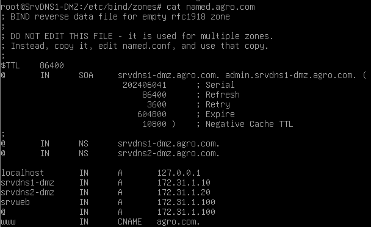
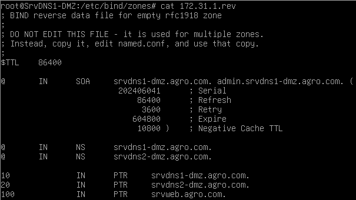

= Ubuntu - DNS configuration

== Installation
sudo apt install bind9

== Debug
*If cache server and there is an issue with own resolving :* sudo ln -sf /run/systemd/resolve/resolv.conf /etc/resolv.conf 

== Configuration

== Master

*Force slave sync :* sudo rndc reload

== Slave

== Cache

*Dump cache :* sudo rndc dumpdb -cache

== Direct zone

== Reverse zone

